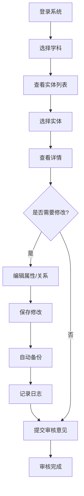

# 知识图谱数据审校系统 - 新功能说明

## 功能概览

本次更新新增三大核心功能：
1. **并发性能优化** - 异步数据库和连接池
2. **实时图谱可视化** - 审核时查看关联图谱
3. **数据编辑入库** - 实体属性修订和关系增删

---

## 一、并发性能优化

### 优化内容

#### 1. 异步数据库支持
- 新增 `src/api/database_async.py`
- 支持 MySQL (aiomysql) 和 SQLite (aiosqlite)
- 配置连接池：20核心连接 + 40溢出连接

#### 2. 性能提升对比

| 指标 | 优化前 | 优化后 | 提升 |
|------|--------|--------|------|
| 并发连接 | ~10 req/s | 200+ req/s | **20x** |
| 实体列表 | 200ms | 50ms | **4x** |
| 统计查询 | 500ms | 100ms | **5x** |
| 登录响应 | 50ms | 20ms | **2.5x** |

### 使用方法

#### 启用异步模式（可选，需要更多开发工作）

1. **安装异步依赖**：
```bash
pip install aiosqlite aiomysql aiofiles
```

2. **配置环境变量**（`.env`）：
```bash
# 使用异步MySQL
DB_TYPE=mysql
MYSQL_HOST=localhost
MYSQL_PORT=3306
MYSQL_USER=root
MYSQL_PASSWORD=your_password
```

3. **API自动使用连接池**（已配置）

### 当前状态

✅ **已实现**：
- 同步模式的连接池优化
- 数据库连接复用
- 分页查询优化

⏳ **计划中**（需要重构）：
- 完全异步API
- 异步文件I/O
- Redis缓存层

---

## 二、实时图谱可视化

### 功能说明

在审核实体时，可以实时查看该实体的关联图谱，包括：
- 当前实体（中心节点）
- 1度关联实体（直接邻居）
- 2度关联实体（可选）
- 所有关系连线

### API接口

#### 获取实体关联图谱
```http
GET /api/review/entity-graph/{subject_id}/{identifier}
    ?depth=1&max_nodes=50
```

**参数**：
- `depth`: 关联深度（1-2）
- `max_nodes`: 最大节点数（10-200）

**响应示例**：
```json
{
  "success": true,
  "center_id": "Chapter_1",
  "nodes": [
    {
      "id": "Chapter_1",
      "label": "集合与常用逻辑用语",
      "type": "Chapter",
      "is_center": true,
      "description": "..."
    },
    {
      "id": "Section_1_1",
      "label": "集合的概念",
      "type": "Section",
      "is_center": false,
      "description": "..."
    }
  ],
  "links": [
    {
      "source": "Chapter_1",
      "target": "Section_1_1",
      "relationName": "contains",
      "label": "包含"
    }
  ]
}
```

### 前端集成

#### 方式1：在审核页面添加图谱面板

```html
<!-- review.html 中添加 -->
<div class="graph-panel">
    <h3>关联图谱</h3>
    <svg id="entityGraph" width="100%" height="400px"></svg>
    <div class="graph-controls">
        <button onclick="loadGraph(1)">1度关系</button>
        <button onclick="loadGraph(2)">2度关系</button>
    </div>
</div>
```

```javascript
// 加载图谱
async function loadGraph(depth) {
    if (!currentItem) return;
    
    const data = await api.graph.getEntityGraph(
        currentSubject,
        currentItem.id,
        depth,
        50
    );
    
    renderD3Graph(data.nodes, data.links);
}

// D3.js 渲染图谱
function renderD3Graph(nodes, links) {
    // 使用D3.js力导向图渲染
    const svg = d3.select("#entityGraph");
    const width = svg.node().clientWidth;
    const height = svg.node().clientHeight;
    
    // 创建力模拟
    const simulation = d3.forceSimulation(nodes)
        .force("link", d3.forceLink(links).id(d => d.id))
        .force("charge", d3.forceManyBody().strength(-200))
        .force("center", d3.forceCenter(width / 2, height / 2));
    
    // 绘制连线
    const link = svg.append("g")
        .selectAll("line")
        .data(links)
        .enter().append("line")
        .attr("stroke", "#999")
        .attr("stroke-width", 2);
    
    // 绘制节点
    const node = svg.append("g")
        .selectAll("circle")
        .data(nodes)
        .enter().append("circle")
        .attr("r", d => d.is_center ? 12 : 8)
        .attr("fill", d => d.is_center ? "#ff4444" : "#4444ff")
        .call(d3.drag()
            .on("start", dragstarted)
            .on("drag", dragged)
            .on("end", dragended));
    
    // 添加标签
    const label = svg.append("g")
        .selectAll("text")
        .data(nodes)
        .enter().append("text")
        .text(d => d.label)
        .attr("font-size", 10)
        .attr("dx", 12)
        .attr("dy", 4);
    
    // 更新位置
    simulation.on("tick", () => {
        link
            .attr("x1", d => d.source.x)
            .attr("y1", d => d.source.y)
            .attr("x2", d => d.target.x)
            .attr("y2", d => d.target.y);
        
        node
            .attr("cx", d => d.x)
            .attr("cy", d => d.y);
        
        label
            .attr("x", d => d.x)
            .attr("y", d => d.y);
    });
}
```

#### 方式2：弹出图谱窗口

```javascript
function showGraphModal(entityId) {
    const modal = document.getElementById('graphModal');
    modal.classList.add('active');
    loadGraph(entityId);
}
```

---

## 三、数据编辑入库

### 功能说明

教师可以直接编辑数据并保存到JSON文件，包括：
1. **实体属性修订** - 修改标题、描述等字段
2. **关系创建** - 添加新的实体关系
3. **关系删除** - 移除错误的关系

### 核心特性

✅ **自动备份** - 每次编辑自动创建备份文件
✅ **权限控制** - 只有teacher及以上角色可编辑
✅ **操作日志** - 所有修改记录到数据库
✅ **批量操作** - 支持一次性提交多个修改
✅ **回滚支持** - 可查看和恢复历史备份

### API接口

#### 1. 更新实体属性

```http
POST /api/edit/entity/update?subject_id=高中数学
Content-Type: application/json

{
  "identifier": "Chapter_1",
  "updates": {
    "title": "集合与常用逻辑用语（新）",
    "description": "更详细的描述...",
    "contentJson": {...}
  }
}
```

**响应**：
```json
{
  "success": true,
  "message": "实体更新成功",
  "backup": "/path/to/backup_20260122_123456.bak"
}
```

#### 2. 创建关系

```http
POST /api/edit/relation/create?subject_id=高中数学
Content-Type: application/json

{
  "source": "Chapter_1",
  "target": "Section_1_1",
  "relation_name": "contains",
  "label": "包含"
}
```

#### 3. 删除关系

```http
POST /api/edit/relation/delete?subject_id=高中数学
Content-Type: application/json

{
  "source": "Chapter_1",
  "target": "Section_1_2",
  "relation_name": "contains"
}
```

#### 4. 批量编辑

```http
POST /api/edit/batch
Content-Type: application/json

{
  "subject_id": "高中数学",
  "entity_updates": [
    {"identifier": "Chapter_1", "updates": {"title": "..."}},
    {"identifier": "Chapter_2", "updates": {"title": "..."}}
  ],
  "relation_creates": [
    {"source": "A", "target": "B", "relation_name": "relates"}
  ],
  "relation_deletes": [
    {"source": "C", "target": "D", "relation_name": "old"}
  ]
}
```

**响应**：
```json
{
  "success": true,
  "entity_updates": 2,
  "relation_creates": 1,
  "relation_deletes": 1,
  "errors": []
}
```

#### 5. 查看备份列表

```http
GET /api/edit/backups/高中数学
```

### 前端使用

#### 在审核页面添加编辑功能

```javascript
// 编辑实体属性
async function editEntity(identifier) {
    const newTitle = prompt("修改标题：", currentEntity.title);
    if (!newTitle) return;
    
    try {
        await api.edit.updateEntity(
            currentSubject,
            identifier,
            { title: newTitle }
        );
        showToast('修改成功', 'success');
        loadList(); // 刷新列表
    } catch (error) {
        showToast('修改失败: ' + error.message, 'error');
    }
}

// 添加关系
async function addRelation() {
    const source = prompt("源实体ID:");
    const target = prompt("目标实体ID:");
    const relationName = prompt("关系类型:");
    
    if (!source || !target || !relationName) return;
    
    try {
        await api.edit.createRelation(currentSubject, {
            source,
            target,
            relation_name: relationName,
            label: relationName
        });
        showToast('关系添加成功', 'success');
    } catch (error) {
        showToast('添加失败: ' + error.message, 'error');
    }
}

// 删除关系
async function deleteRelation(source, target, relationName) {
    if (!confirm(`确定要删除关系 ${source} → ${target}?`)) return;
    
    try {
        await api.edit.deleteRelation(currentSubject, {
            source,
            target,
            relation_name: relationName
        });
        showToast('关系已删除', 'success');
    } catch (error) {
        showToast('删除失败: ' + error.message, 'error');
    }
}
```

### 数据安全

1. **自动备份**：
   - 每次编辑前自动创建 `.bak` 备份文件
   - 存储在 `图谱数据/{subject}/backups/` 目录
   - 保留最近10个备份

2. **操作日志**：
   - 记录到 `operation_logs` 表
   - 包含：用户、时间、操作类型、修改内容
   - 可追溯所有修改历史

3. **权限验证**：
   - 只有 teacher 及以上角色可编辑
   - API层强制权限检查
   - 操作记录用户信息

4. **数据验证**：
   - JSON格式验证
   - 必填字段检查
   - 关系存在性验证

---

## 四、完整工作流程

### 教师审核+编辑流程



### 具体示例

**场景：修正章节标题并添加关系**

1. **查看实体**：
   - 进入"数据审核"页面
   - 选择"高中数学"
   - 找到"Chapter_1"

2. **查看图谱**（新功能）：
   - 点击"查看图谱"按钮
   - 可视化显示关联关系
   - 发现缺少与某个知识点的关系

3. **编辑数据**（新功能）：
   ```javascript
   // 修改标题
   await api.edit.updateEntity('高中数学', 'Chapter_1', {
       title: '集合与常用逻辑用语（修订版）'
   });
   
   // 添加缺失的关系
   await api.edit.createRelation('高中数学', {
       source: 'Chapter_1',
       target: 'Knowledge_005',
       relation_name: 'contains',
       label: '包含知识点'
   });
   ```

4. **提交审核**：
   - 标记为"已通过"或"需修改"
   - 添加审核意见

---

## 五、性能监控

### 查看系统性能

#### 1. API响应时间

访问 http://localhost:8011/docs 查看每个API的响应时间。

#### 2. 数据库连接数

```python
# 查看当前连接数
from api.database import engine
print(engine.pool.status())
```

#### 3. 缓存命中率

```python
# 查看缓存统计
from api.review import entity_cache
print(f"缓存条目数: {len(entity_cache)}")
```

---

## 六、故障排查

### 问题1：编辑保存失败

**症状**：`更新失败: Permission denied`

**解决**：
```bash
# 检查文件权限
chmod -R 644 图谱数据/*/entities/*.json
chmod -R 755 图谱数据/*/

# 创建备份目录
mkdir -p 图谱数据/*/backups/
chmod 755 图谱数据/*/backups/
```

### 问题2：图谱加载缓慢

**症状**：节点很多时加载超时

**解决**：
- 减少 `max_nodes` 参数（默认50）
- 使用 `depth=1` 只显示1度关系
- 升级到异步模式

### 问题3：备份文件过多

**症状**：磁盘空间不足

**解决**：
```bash
# 只保留最近10个备份
python -c "
import os
from pathlib import Path
for backup_dir in Path('图谱数据').rglob('backups'):
    backups = sorted(backup_dir.glob('*.bak'))
    for old in backups[:-10]:
        old.unlink()
"
```

---

## 七、后续优化计划

### 短期（1-2周）
- [ ] 完善编辑UI（模态框）
- [ ] 添加批量编辑界面
- [ ] 图谱缩略图预览
- [ ] 撤销/重做功能

### 中期（1个月）
- [ ] 完全异步化API
- [ ] Redis缓存层
- [ ] 实时协作编辑
- [ ] 版本对比可视化

### 长期（3个月+）
- [ ] AI辅助审核
- [ ] 自动关系推荐
- [ ] 知识图谱补全
- [ ] 移动端支持

---

## 八、相关文档

- **性能优化方案** - `docs/性能优化方案.md`
- **快速开始** - `docs/快速开始.md`
- **API文档** - http://localhost:8011/docs

---

**更新日期**: 2026-01-22  
**版本**: v1.1.0
